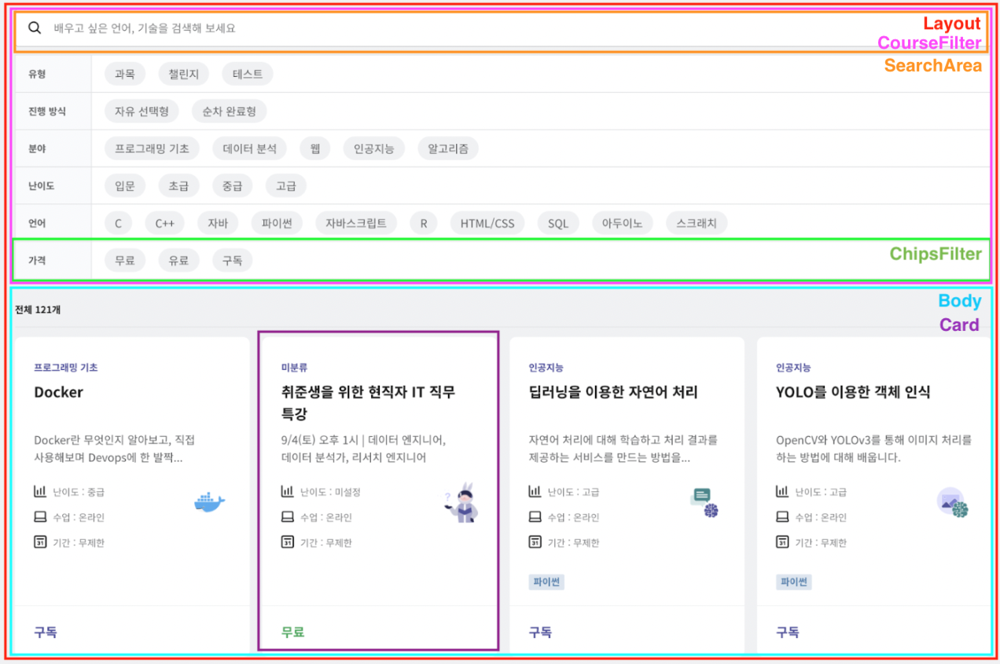
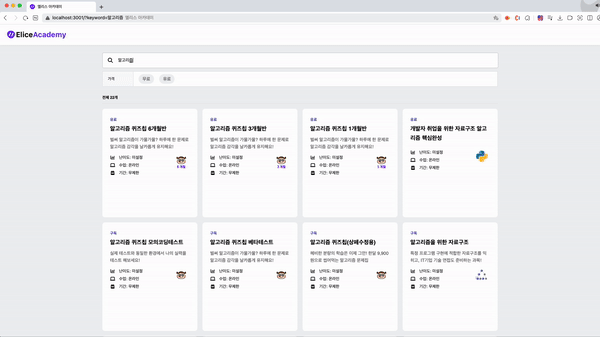

# elice Frontend Team PA

엘리스 Web Frontend팀 Programming Assignment를 구현하였습니다.

## 기술 스택

- React hooks + Functional Components
- TypeScript, eslint, prettier
- emotion
- axios
- React Router

## 폴더 구조

```bash
src
├── index.tsx
├── App.tsx
├── components
│   ├── atoms
│   │   ├── Buttons
│   │   ├── Cards
│   │   ├── filters
│   │   ├── headers
│   │   └── searchAreas
│   ├── organisms
│   │   ├── CourseFilter.tsx
│   │   ├── EmptyResult.tsx
│   │   ├── Pagination.tsx
│   │   └── Results.tsx
│   └── templates
│       └── Layout.tsx
├── pages
│   └── Body.tsx
├── api
│   ├── axios.custom.ts
│   └── axios.instance.ts
├── hooks
│   ├── useCourses.tsx
│   └── useDebounce.ts
├── styles
│   └── globalStyle.tsx
└── types
    ├── apiDto.ts
    └── filterOptions.ts
```

### 디렉토리 상세

- `components` : 프로젝트 내부에서 재사용되는 컴포넌트 폴더로, atomic design pattern을 간소화하여 차용했습니다.
  - `atoms` : 기존 atomic design pattern의 atom과 molecule 단위를 통합했습니다.
  - `organisms` : 필터, 페이지네이션 등 사용자에게 의미와 역할이 존재하는 단위로, molecule의 결합입니다.
  - `templates` : 데이터를 연결하지 않은 organism의 배치입니다.
- `pages` : 데이터가 결합되어 사용자에게 전달되는 영역입니다.
- `api` : API URL, axios 인스턴스 및 로직이 정의되어 있습니다.
- `hooks` : 커스텀 훅 폴더입니다.
- `styles` : `reset.css` 를 포함한 전역 스타일링 속성을 정의했습니다.
- `types` : API 응답 형태, 필터 옵션 등 통일되어야 하는 타입이 정의되어 있습니다.

## 컴포넌트 구상



- `Layout`
  - 헤더를 제외하고 페이지의 모든 요소를 감싼 컴포넌트로, UI 배치를 결정합니다.
- `CourseFilter`
  - 검색창 및 Chips 필터 쿼리를 종합한 정보를 갖고 있도록 구상한 영역입니다.
  - 구현 과정에서 `useSearchParams` 및 `useState` 를 사용하여 각 컴포넌트가 각각 쿼리를 반영하게 되었지만, 추후 필터가 더욱 복잡해질 경우를 위해 남겨두었습니다.
- `SearchArea`
  - 사용자에게 보여지는 검색창으로, 입력한 키워드를 URL query에 반영합니다.
- `ChipsFilter`
  - 사용자에게 보여지는 Chips 필터로, 선택한 키워드를 URL query에 반영합니다.
- `Body`
  - API를 요청하고 해당 응답에 대한 정보를 갖고 있는 컴포넌트입니다.
- `Card`
  - `Body` 컴포넌트로부터 과목 정보를 받아 각 과목에 대해 정보를 시각화한 컴포넌트입니다.

## 요구사항 구현

### 1. 상태 관리

- 과제의 규모가 작아 컴포넌트 depth가 깊지 않을 것으로 생각하여, 별도의 상태 관리 라이브러리 없이 React hooks만 사용하여 구현했습니다.
- React Router의 `useSearchParams` 를 사용하면 `searchParams` state로 query 값을 읽고 수정할 수 있습니다. 따라서 `Search Area` 와 `Filter` 컴포넌트에서 각각 local state를 통해 사용자가 입력한 값을 query에 반영해도 무리가 없었습니다.

### 2. Search Area의 debounced search

- `useRef` 를 사용한 `useDebounce` 커스텀 훅을 구현하여 사용했습니다.

```typescript
function useDebounce<T extends any[]>(
  callback: (...params: T) => void,
  delay: number,
): (...params: T) => void;
```

- 다양한 콜백함수에 대해 재사용 가능해야 하므로, rest parameter와 any 타입을 사용했습니다.
- 콜백함수와 `delay` 시간을 인자로 받으면, 함수 내부에서 `useRef` 를 사용하여 타이머 id를 저장합니다. 주어진 `delay` 안에 연속으로 이벤트가 발생하는 경우 `clearTimeout`에 의해 타이머가 클리어된 후 재설정됩니다.

### 3. URL query 동기화

- query string을 가져오기 위해 React Router의 `useLocation` 과 `useSearchParams` hook을 고려하였습니다.
  - `useLocation` 은 query string을 그대로 가져오는 반면, `useSearchParams` 는 키값을 통해 필요한 데이터만 가져올 수 있습니다. `SearchArea` 와 `ChipsFilter` 컴포넌트에서 각각 다른 데이터를 수정하기 위해 `useSearchParams` 를 사용했습니다.
- `SearchArea` : 현재의 query string으로부터 `inputValue` state를 초기화하고, 300ms에 한 번씩 `inputValue` 에 따라 `searchParams` 를 변경합니다.
  - `searchParams` 는 URLSearchParams 객체로, `set` 과 `append` 메서드를 사용해 속성을 추가할 수 있습니다. 이 때 `set` 을 사용하면 동일한 키를 가진 속성을 **덮어씁니다.** `keyword` 속성은 한 개만 존재해야 하므로 `append` 가 아닌 `set` 메서드를 사용했습니다.
- `ChipsFilter` : 자바스크립트의 Set 객체를 사용하여, 현재의 query string 중 `category`(본 과제의 경우, 'price') 키를 가진 고유한 값들의 집합을 state에 저장합니다. 사용자가 누른 `Chip` 의 `name` 에 해당하는 값을 query string에 추가합니다.
  - 이 때, `Chip` 은 여러 개 선택할 수 있으므로 동일한 키를 가진 여러 값이 존재하게 됩니다. URLSearchParams 의 `delete` 메서드는 인자로 받은 키에 대해 **모든 값을 삭제**합니다. 따라서 수정 이전의 query string을 별도의 상태로 저장해 두었다가, `filter` 메서드를 사용하여 해제된 `Chip` 을 제외한 나머지 값들을 다시 추가했습니다.

### 4. filter_conditions 파라미터 생성 및 API 호출

- `Body` 가 **최초** 렌더링될 때 전체 과목 카드가 렌더링되어야 하므로, **render 메서드 이전에 API 호출 결과가 변수에 저장되도록** `useCourse` hook을 구현하여 사용했습니다.
- API를 호출하는 커스텀 hook `useCourses` 내부에서, 과제에 주어진 예시와 동일한 형식의 객체를 생성하여 값을 추가했습니다.
- hook이 `course_count` 와 `status` 상태를 리턴하도록 구현하여, 과목 카드 혹은 로딩, 에러 문구가 조건부 렌더링됩니다.

### 5. 페이지네이션

- API 호출 시에도 `offset` 정보가 필요하므로 상위 컴포넌트인 `Body` 에서 `offset` state를 0으로 초기화한 후, `Pagination` 컴포넌트에 props로 전달했습니다.
- 검색 조건이 변경되면 `offset` 이 0으로 돌아가야 하므로 `Body` 컴포넌트에서 `searchParams` 에 의존하는 `useEffect` 를 사용했습니다.
- `Pagination` 컴포넌트 내부에서 `offset` 과 `course_count` 값을 사용하여 첫/마지막 페이지 여부 및 렌더링할 버튼 개수를 계산했습니다.

## 동작 화면



## 개선할 점

- API 호출에 필요한 `filter_conditions` 객체 생성을 별도로 분리하여 재사용성을 높일 수 있습니다.

  - `filter_conditions` 객체는 파라미터 형식 및 필터 종류가 달라짐에 따라 변화하기 쉬운 값입니다. 따라서 key-value 값들을 인자로 받아 객체를 리턴하는 함수 혹은 hook을 만들어 분리함으로써 이후 수정사항에 유연하게 대응할 수 있을 것 같습니다. 본 과제에서는 예시 형식과 동일한 형태로 하드코딩으로 구현한 것이 한계점으로 남았다고 생각합니다.

- `useMemo`, `useCallback` 등을 사용한 최적화 작업
  - state의 변경이 빈번하게 일어나는 컴포넌트의 경우, 재렌더링 시 함수들도 다시 재생성되는 비효율성이 발생할 수 있습니다.
  - 예를 들어 `searchArea` 는 `inputValue` state가 변경될 때마다 매번 재렌더링되지만, 검색을 수행하는 `debouncedSearch` 함수는 **delay 만큼 지난 후의 inputValue** 값의 변경에 의존합니다. 따라서 `useCallback` hook을 사용하여 보다 최적화된 구조로 개선할 수 있을 것 같습니다.
